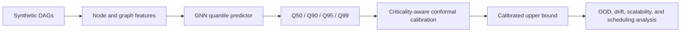
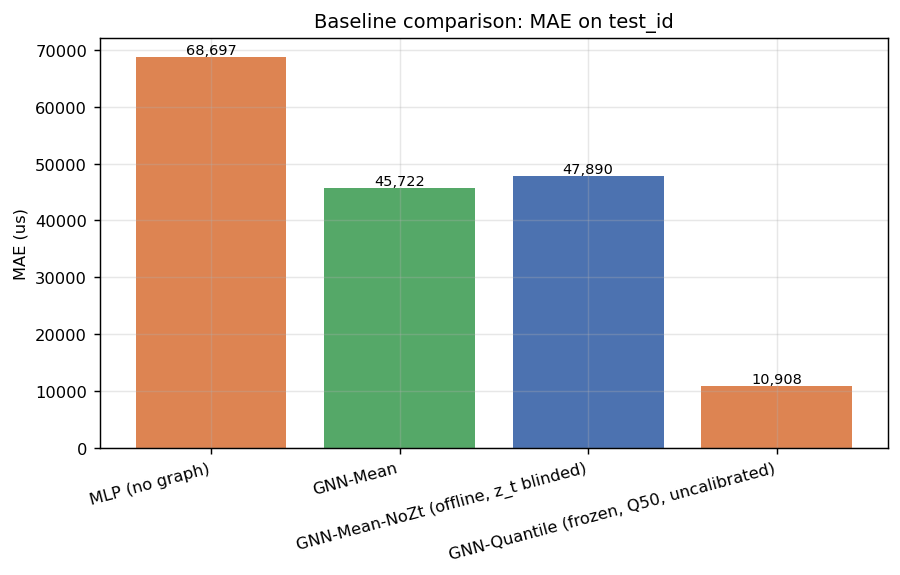
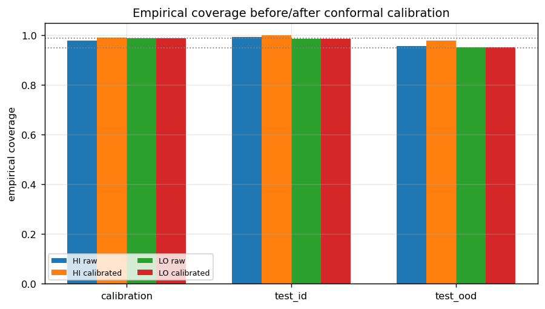
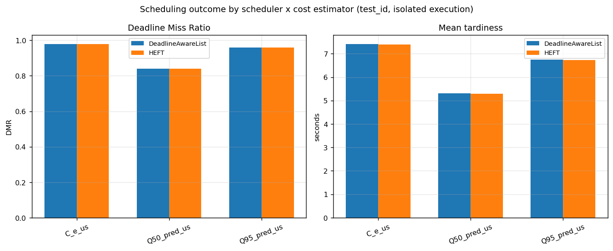

# Risk-Calibrated DAG Runtime Prediction with Graph Neural Networks

This repository studies execution-time prediction for nodes in directed acyclic graphs (DAGs) running on a heterogeneous multicore platform with dynamic voltage and frequency scaling (DVFS). It combines a graph neural network (GNN) quantile predictor with group-wise split conformal calibration, then evaluates accuracy, distribution shift, drift, scalability, and downstream real-time scheduling behavior.

The project was developed for a Real-Time Systems course at Sharif University of Technology. All reported ground truth comes from a synthetic simulator; the results should not be interpreted as measurements from physical hardware.

## Overview

The pipeline has two stages:

1. **Quantile runtime prediction.** A GNN predicts per-node execution-time quantiles (`Q50`, `Q90`, `Q95`, and `Q99`) using graph structure, task attributes, hardware type, DVFS state, and runtime context.
2. **Risk calibration and systems evaluation.** Group-wise split conformal prediction calibrates upper bounds separately for high- and low-criticality tasks. The frozen predictor is then tested under in-distribution and out-of-distribution conditions, synthetic drift, core-count stress, and two DAG schedulers.



## Key empirical results

| Evaluation | Result |
|---|---:|
| Q50 MAE, test-ID | **10.91 ms** |
| Q50 MAE, test-OOD | **16.65 ms** |
| Raw Q95 coverage, test-ID | **99.00%** |
| Raw Q95 coverage, test-OOD | **95.38%** |
| Calibrated overall coverage, test-ID | **99.29%** |
| Calibrated overall coverage, test-OOD | **96.52%** |
| Q50 quantile-crossing rate | **0.00%** |

On test-ID data, the frozen quantile GNN achieved a Q50 MAE of 10.91 ms, compared with 45.72 ms for a separately trained mean-regression GNN and 68.70 ms for an MLP without graph structure. These baselines used a reduced training budget, so the comparison supports a directional conclusion rather than a fully tuned benchmark claim.



The conformal layer uses a Q95 base prediction with target marginal coverage of 99% for high-criticality nodes and 95% for low-criticality nodes. Under structural distribution shift, observed calibrated coverage was 97.90% for high-criticality nodes and 95.14% for low-criticality nodes. The high-criticality OOD result falls below its nominal target, illustrating the limits of exchangeability-based calibration under shift.



## Scheduling interpretation

The scheduling experiment evaluates 50 test-ID DAGs independently on an idle 4-core platform using HEFT and a deadline-aware list scheduler. The deadline-miss ratio increases from 0.84 with optimistic Q50 costs to 0.98 with fully calibrated conservative bounds. This is an important negative result: the calibrated bound is useful for admission and safety analysis, but is too pessimistic to use directly as a throughput-oriented scheduling cost on an undersized platform.



## Repository structure

```text
.
├── data/                  # Generation instructions; full generated dataset is not tracked
├── models/                # Frozen predictor, preprocessing state, and calibration state
├── notebooks/             # Dataset generation, Phase 1 training, and narrated Phase 2 analysis
├── results/               # Metrics, tables, predictions, and figures
├── scripts/               # Reproducible Phase 2 experiment entry points
├── src/
│   ├── phase1/            # Frozen-model reconstruction
│   └── phase2/            # Calibration, OOD, drift, scalability, and scheduling modules
├── PHASE2_REPORT.md       # Full technical report in English
├── PHASE2_REPORT_FA.md    # Full technical report in Persian
└── requirements.txt
```

## Installation

Python 3.10 or newer is recommended.

```bash
python -m venv .venv
source .venv/bin/activate        # Windows: .venv\Scripts\activate
python -m pip install --upgrade pip
pip install -r requirements.txt
```

PyTorch Geometric may require a platform-specific installation command for some CUDA configurations. Consult its installation guide if the standard `pip` installation does not match your PyTorch/CUDA build.

## Data preparation

The full generated dataset is intentionally excluded from Git because it contains more than ten thousand small artifacts and substantially increases repository size. Generate it locally with:

```bash
jupyter lab notebooks/01_generate_execution_time_dataset_25k.ipynb
```

The expected output directory is:

```text
data/dag_runtime_dataset_25k/
```

See [`data/README.md`](data/README.md) for the expected layout.

## Reproducing the experiments

Train and export the Phase 1 quantile predictor with:

```text
notebooks/02_train_gnn_quantile_predictor.ipynb
```

After generating the dataset and Phase 1 artifacts, run Phase 2 from the repository root:

```bash
python scripts/run_phase2_inference.py
python scripts/run_phase2_calibration.py
python scripts/run_phase2_ood_structure.py
python scripts/run_phase2_scalability.py
python scripts/run_phase2_drift.py
python scripts/run_phase2_scheduling.py
python scripts/run_phase2_baselines.py
python scripts/run_phase2_deepdive.py
python scripts/run_phase2_plots.py
```

Generated metrics and figures are written under `results/phase2/`. The committed result files allow the findings to be inspected without rerunning the full pipeline.

## Methodological safeguards

- The Phase 1 predictor and preprocessing state are frozen before Phase 2 evaluation.
- Calibration and evaluation splits are kept separate.
- Conformal corrections are fitted separately for high- and low-criticality nodes.
- Results are reported for both in-distribution and structurally shifted DAGs.
- Quantile predictions are compared with independent MLP and mean-regression GNN baselines.
- Scheduling results report deadline-miss ratio and tardiness, not only makespan.

## Limitations

- Execution-time targets are produced by a synthetic simulator rather than physical hardware.
- The scheduling experiment models one DAG at a time and does not include preemption, admission control, or multi-job interference.
- The 8/16/32-core scalability study changes the model's active-core-count feature; it is not a new hardware simulation.
- The critical-path indicator is topological rather than compute-cycle weighted.
- Baseline models were trained with a reduced compute budget.
- Marginal conformal guarantees rely on exchangeability and may degrade under distribution shift.

For the complete experimental design, result tables, and interpretation, see the [English report](PHASE2_REPORT.md) or the [Persian report](PHASE2_REPORT_FA.md).
